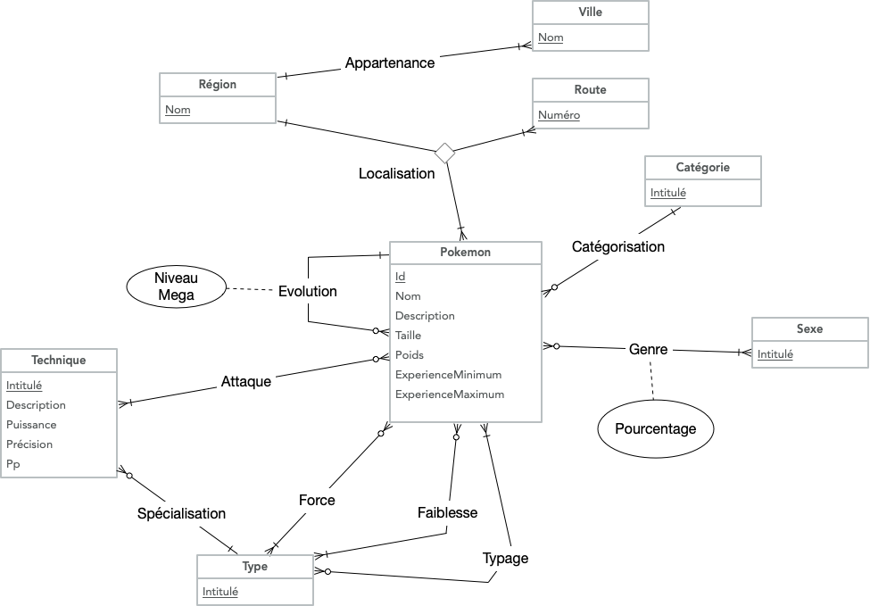
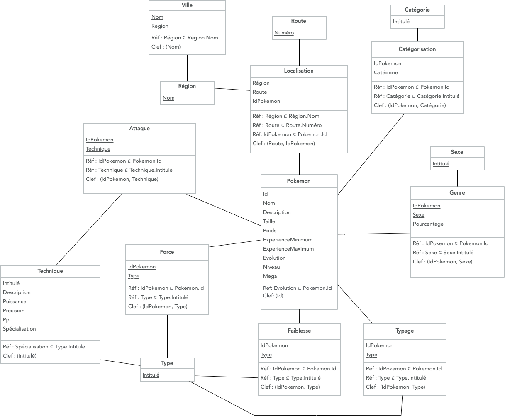

# PokeDB

## Pré-requis
* Python3.7+
* Pipenv (`pip3 install pipenv`)

## Démarrage rapide
* Clonez le dépôt `git clone ssh://git@ssh.hesge.ch:10572/baptiste.coudray/pokedb.git`
* Exécutez `docker-composer up`
* Exécutez `pipenv install`
* Exécutez `pipenv shell`
* Exécutez `python3 cli/pokemon.py`

## Base de données

### Modèle Conceptuel de Données

    

### Modèle Logique de Données

    

